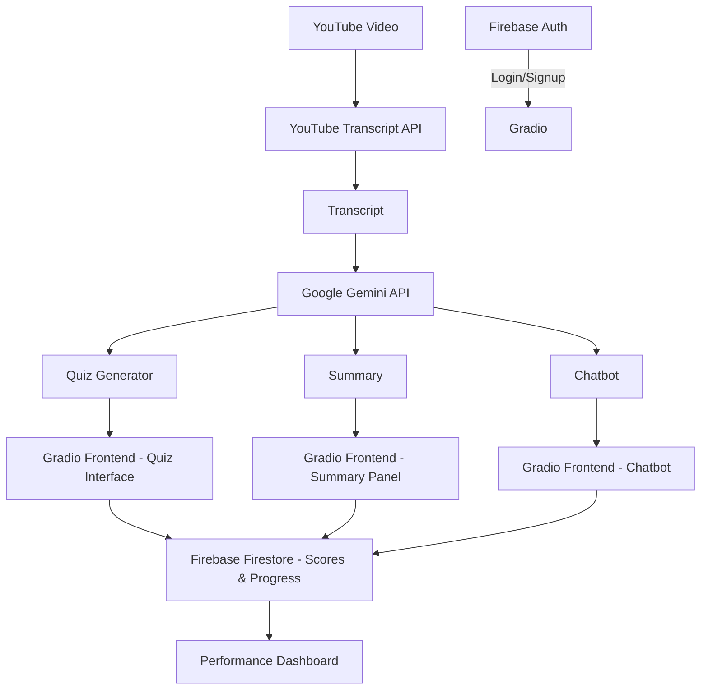

# Viducate  

Viducate is an AI-powered learning assistant that transforms lecture videos into summaries, adaptive quizzes, and interactive Q&A. It helps students learn smarter and educators assess better, making digital learning more engaging and effective.  


## Features

- **Video Input** – Paste any YouTube lecture link  
- **Auto Summarization** – Get concise key points from long lectures  
- **Adaptive Quiz Generator** – Creates quizzes from summaries for active recall  
- **AI Chatbot** – Ask questions related to the lecture and get instant answers  
- **Performance Dashboard** – Track quiz scores and learning progress  
- **User Accounts** – Login & signup for personalized experience (Firebase Auth)  


## System Architecture



## Getting Started  

### 1. Clone the Repository  
```bash
git clone https://github.com/Yashshri-22/viducate.git
cd viducate
```
---
### 2. Install Dependencies  
```bash
pip install -r requirements.txt
```
---
### 3. Set Up API Keys
Create a .env file in the root directory and add:
```bash
GOOGLE_API_KEY=your_gemini_api_key
FIREBASE_CONFIG=your_firebase_config_json
```
---
### 4. Run the App
```bash
python app.py
```

Gradio will launch the app at:
👉 http://127.0.0.1:7860/

---

## Demo Flow

Login / Sign up  -> Enter YouTube Link -> Generate Summary -> Take Quiz

Ask Questions via Chatbot

## Use Cases

- Students: Quickly revise long lectures and test understanding

- Educators: Create quizzes and track student performance

- Institutions: Enhance e-learning platforms with AI-powered assessments

## Contributors

Yashshri Mule

Trushita Sathe

Sanika Talkhedkar

Janki Darandale


## License

This project is licensed under the MIT License.
---